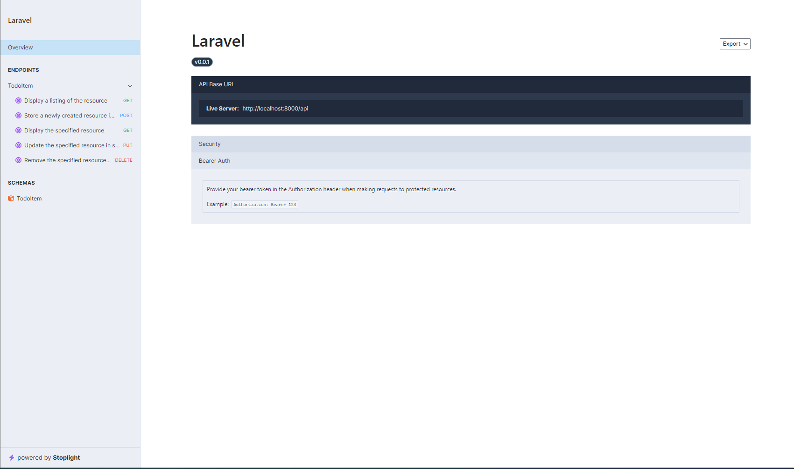
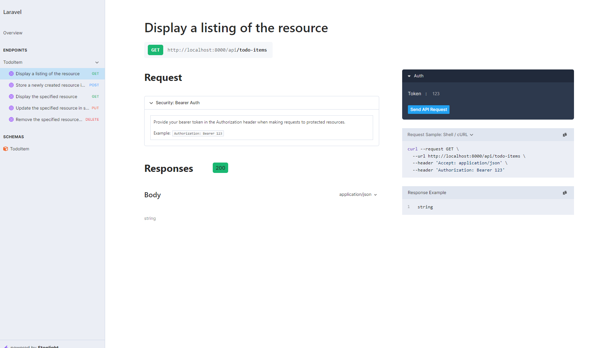

# Laravel Scramble Docs Demo

This is a demo of the [Laravel Scramble Docs](https://scramble.dedoc.co/) package.

Documentation is generated from the codebase and is available at [http://localhost:8000/api/docs](http://localhost:8000/api/docs)

## Screenshots

| Landing  | Index |
| --- | --- |
|  |  |


## Getting Started

### Prerequisites

- PHP 7.4 or higher
- Composer


### Installation

1. Clone the repo
   ```sh
   git clone
    ```
2. Install Composer packages
    ```sh
    composer install
    ```
3. Create a new .env file
    Default values are already set in the .env.example file
    ```sh
    cp .env.example .env
    ```

4. Generate a new application key
    ```sh
    php artisan key:generate
    ```


5. Run the migrations
    Default DB is SQLite
    ```sh
    touch database/database.sqlite && php artisan migrate
    ```

6. Start the server    
    ```sh
    php artisan serve
    ```

7. Visit the Docs at [http://localhost:8000/api/docs](http://localhost:8000/api/docs)
